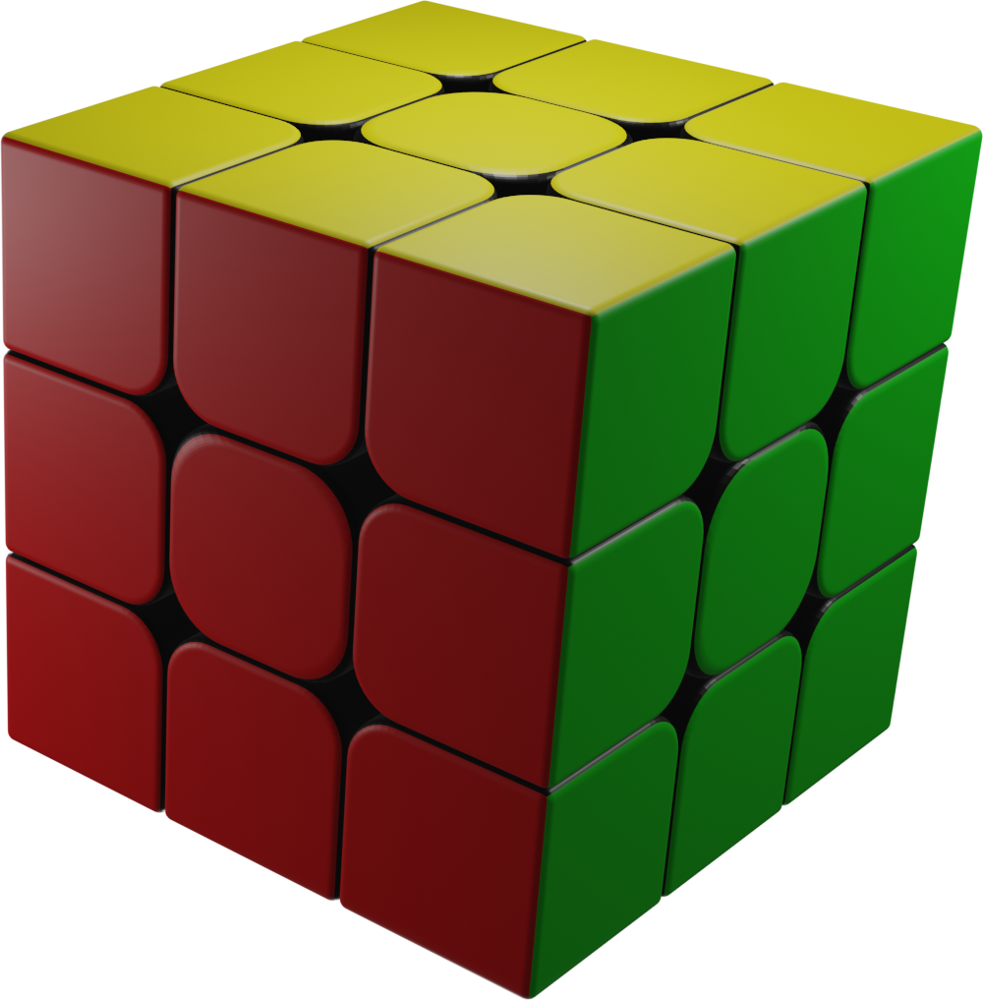
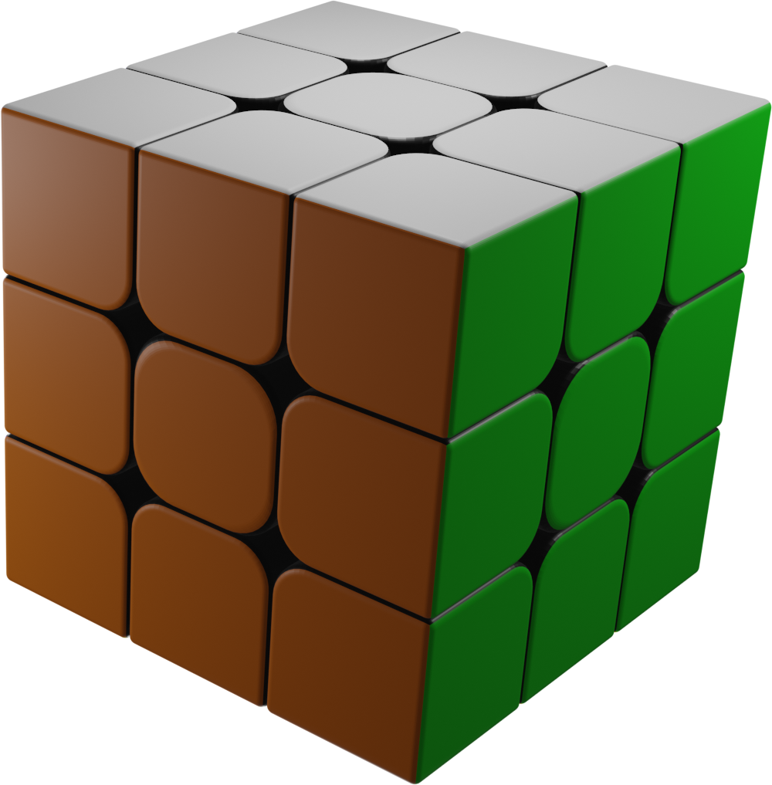

# Introdução ao Cubo Mágico
## Esquema de Cores
As cores encontradas no Cubo Mágico seguem as seguintes regras:
* Branco oposto ao  Amarelo
* Vermelho oposto ao Laranja (cores quentes)
* Azul oposto ao Verde (cores frias)
* Com Vermelho na frente e Amarelo em cima, à direita se tem o Verde

## Peças

# Método Roux Iniciante
# Método Roux Completo
## Neutralidade de cor
## Primeiro Bloco
### Meio + Pares
### Meia Linha + Par
### Linhas

# Tópicos Avançados
## EOLR
## Pinkie Pie