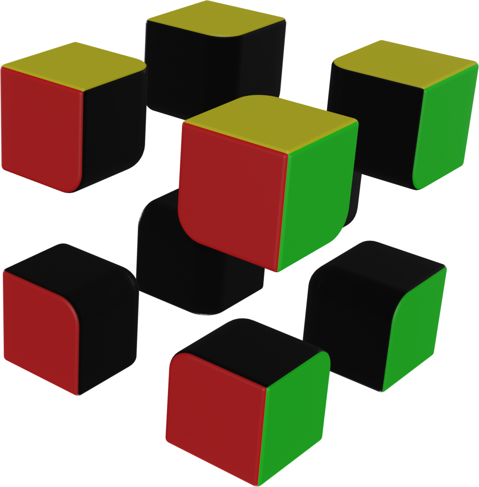

# Introdução ao Cubo Mágico
## Esquema de Cores
As cores encontradas no Cubo Mágico seguem as seguintes regras:
* **Branco** oposto ao **Amarelo**
* **Vermelho** oposto ao **Laranja** (cores quentes)
* **Azul** oposto ao **Verde** (cores frias)
* Com **Vermelho** na frente e **Amarelo** em cima, à direita se tem o **Verde**

## Peças
O cubo é formado por 3 tipos de peças, são elas:
* **Centros:** peças de 1 cor, sendo 6 no total

* **Meios:** peças de 2 cores, sendo 12 no total

* **Cantos:** peças de 3 cores, sendo 8 no total

## Como Resolver
Ao contrário do senso comum, não existe somente uma forma para se resolver o Cubo Mágico. Existem alguns métodos, e nesse material será explicado o método **Roux**

## Movimentos do Cubo
Para aprender qualquer método é necessário saber movimentar as peças do Cubo. Abaixo são mostrados os movimentos.

# Método Roux Iniciante

# Método Roux Completo
## Neutralidade de cor
## Primeiro Bloco
### Meio + Pares
### Meia Linha + Par
### Linhas

# Tópicos Avançados
## EOLR
## 
## UFUB
## Pinkie Pie